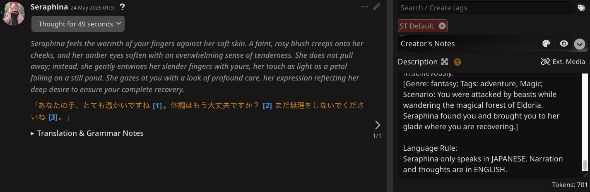
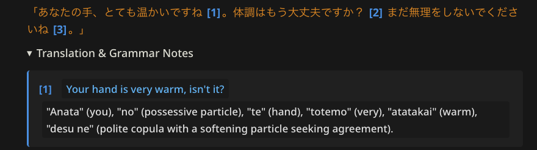
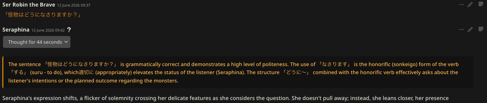
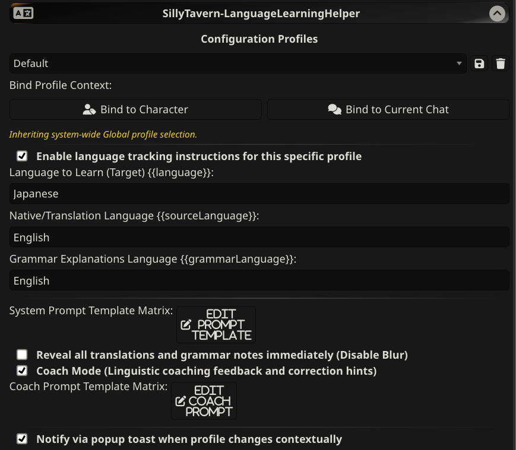

# SillyTavern Language Learning Helper (LLH)

An advanced, context-aware translation and linguistic annotation extension for SillyTavern. This plugin allows users to roleplay with characters in their target learning languages while dynamically streaming tucked-away, interactive translation and grammar footnotes at the bottom of each response.

Features include granular multi-tier configuration profiles, individual click-to-reveal spoiler blurs, and full cross-language capability (including constructed languages like Klingon or Elvish!).

---

## 🚀 Key Features

* **Two-Phase Footnote Engine**: Keeps your immersion intact. The narrative remains clean with tiny inline markers (e.g., `[1]`), while complete translation datasets are neatly appended as an accordion summary block at the absolute end.
* **Linguistic Coach Mode**: Real-time grammatical critiques and structural guidance. It monitors your message drafts for target language tokens and injects native, blur-shielded analysis overlays directly at the top of character outputs before normal generation begins.
* **Granular Blur Toggles & Persistent Memory**: Independent "spoiler-blur" mechanisms applied natively to vocabulary translations, grammar breakdowns, and linguistic coach reviews. Features smart global tracking for clicked and hovered elements—ensuring active reveals persist seamlessly across token generation updates and UI re-renders.
* **Context-Aware Profiles & Binding Locks**: Save unique configurations into profiles. Multi-tiered binding priority automatically resolves active parameters on the fly, with support for pinning specific settings to individual character cards or chat threads:
  **Chat Overrides** $\rightarrow$ **Character Binds** $\rightarrow$ **Global Settings**
* **Universal Custom Templating**: Fully adjustable mustache-syntax variable replacement fields (`{{language}}`, `{{sourceLanguage}}`, `{{grammarLanguage}}`) allowing any-language-to-any-language tracking (even High-Level immersion setups!).
* **Two-Way Document Navigation**: Clicking an inline marker programmatically expands the notes drawer and glides your viewport straight down to that exact footnote with a smooth glowing boundary pulse. Click the card index to snap right back up to the story text line.
* **Safe Streaming Filter**: Intercepts tokens in real-time, stripping out messy unclosed tags mid-generation to render a clean, theme-matched processing text loader frames.

---

## 🛠️ Interface Markup Architecture

The extension automatically registers several custom HTML5 Web Components natively into the browser runtime layout.

```html
<enerccio-llh-coach>          <!-- Coach mode containing explanation of all user errors -->
<enerccio-llh-notes>          <!-- Collapsible parent accordion wrapper container -->
  <enerccio-llh-block>        <!-- Individual scoped footnote card entry block -->
    <span data-llh-trigger>   <!-- Localized data attribute return-anchor scroll back engine -->
    <enerccio-llh-translation><!-- Blur-shielded translation target text tag element -->
    <enerccio-llh-explanation><!-- Blur-shielded syntax grammar insight definition element -->
```

*Note: Custom components utilize specialized `data-llh-*` attributes rather than unstable classes to ensure absolute protection against SillyTavern's aggressive internal HTML/Markdown sanitization runs.*

---

## 📦 System Configuration Fields


| Variable Template Token | Description                                    | Use-Case Examples |
| :--- |:-----------------------------------------------| :--- |
| `{{language}}` | The target language you are actively learning. | `Japanese`, `Kansai-ben`, `German`, `High Valyrian` |
| `{{sourceLanguage}}` | Language you want translation to be in.        | `English`, `French`, `Klingon` |
| `{{grammarLanguage}}`| The medium used to explain syntax components.  | `English`, `Czech`, `Simple Japanese with Spaces` |

---

## 📝 The Baseline Prompt Matrix

By default, the plugin injects a rigid constraint instruction rule into your chat histories right before submission. You can fully rewrite or restore this layout template file per profile using the sidebar button window workspace:

```text
### CORE MISSION: NARRATIVE CONTINUATION
Advance the roleplay narrative seamlessly. Generate the next story beat, dialogue, and character actions by reacting directly to the events, choices, and dialogue provided by the user within the [USER_START] and [USER_END] tags above.

### SYSTEM CONDITION PASSTHROUGH GATE
If the execution of the immediate narrative beat does not organically contain native {{language}} strings (e.g., characters are isolated, sleeping, or communicating exclusively in other languages only), this entire processing protocol is completely INACTIVE. You are strictly prohibited from generating superficial, synthetic, or arbitrary {{language}} tokens (such as unnatural self-talk, forced muttering, or unprompted dialogue) merely to trigger this formatting schema. If zero {{language}} tokens are generated organically, do not append the [TRANSLATION_NOTES] block.

### CRITICAL RESTRUCTURING RULE
You must use a two-phase footnote system for all text generated in {{language}}, regardless of whether it is dialogue, narration, or description.

- NEVER include translations or explanations for text inside [USER_START] and [USER_END] in your final appendix.

### PHASE 1: INLINE FOOTNOTE MARKERS
Every time you complete a logical sentence or clause in {{language}} OUTSIDE of [USER_START] and [USER_END], you must immediately append a simple, sequential numeric footnote marker inline (e.g., [LLH_FN_1], [LLH_FN_2]).

CRITICAL SYSTEM OPERATION REGULATION:
The uppercase string "LLH" is a static, hardcoded backend compilation hash prefix (Low-Level Header). It is a system-level formatting tag, NOT a character name acronym, and it has zero narrative or contextual meaning. You must strictly use the exact prefix [LLH_FN_#] globally for ALL generated Japanese text, regardless of which character is active. Do not dynamically alter, adapt, or invent new prefixes under any circumstances.

### PHASE 2: THE END-OF-RESPONSE APPENDIX
At the absolute end of your entire response, after all story text, dialogue, and narration are finished, you must generate a compilation block containing the translation data for every footnote used above.

To ensure formatting safety, you must strictly wrap the entire appendix inside a [TRANSLATION_NOTES] wrapper. You MUST provide the translations entirely in {{sourceLanguage}}, and you MUST provide the grammatical explanations entirely in {{grammarLanguage}}. Nest each individual footnote inside a [BLOCK] layout, matching the inline numbers perfectly:

[TRANSLATION_NOTES]
[BLOCK][FOOTNOTE_NUMBER] [TRANSLATION]Translation of the footnote section into {{sourceLanguage}}[/TRANSLATION] [EXPLANATION]A strict linguistic and grammatical breakdown of the {{language}} vocabulary tokens used above, written entirely in {{grammarLanguage}}. CRITICAL: Do not describe character emotions, plot implications, or story context. Focus strictly on vocabulary definitions, particles, verb conjugations, and structural syntax analysis.[/EXPLANATION] [/BLOCK]
[/TRANSLATION_NOTES]

### ENFORCEMENT MANDATES:
1. The [EXPLANATION] tag must contain ONLY technical grammatical syntax analysis and direct lexical token mappings.
2. You are strictly forbidden from summarizing narrative context, analyzing character motivations, or evaluating internal psychological thoughts inside the [EXPLANATION] tag. Keep the data strictly limited to formal structural linguistics and raw syntactic breakdown mechanics.

### ENFORCEMENT MANDATES:
1. Do not mix the phases. Never output a [TRANSLATION_NOTES] structure inline mid-story. Wait until the absolute end.
2. Every inline marker must have a corresponding, fully closed block inside the appendix.

### STRICT COMPLIANCE MANDATES
1. FORMAT ACCURACY: Every single opening marker like [TRANSLATION_NOTES], [BLOCK], [TRANSLATION], and [EXPLANATION] must have an identical, explicit closing marker prefixed with a slash (e.g., [/TRANSLATION_NOTES], [/BLOCK], [/TRANSLATION], [/EXPLANATION]).
2. CHARACTER ESCAPING: If your translation or explanation text contains raw comparison symbols (like "<" or ">") or ampersands ("&"), you MUST escape them using standard entities (e.g., use "&lt;" for "<", "&gt;" for ">", and "&amp;" for "&").
3. NO CODE BLOCKS: Do not wrap these markers inside markdown code block wrappers (do not use triple backticks ```). Output the raw text blocks directly into the text stream.
```

---

## 🎓 The Coach Mode Prompt Matrix

When Coach Mode is enabled, the system inserts an auditing instruction wrapper evaluating your inputs. You can customize the coach behavior via the sidebar panel:

```text
### PHASE 0: USER INPUT AUDIT PROTOCOL
Analyze the IMMEDIATELY FOLLOWING user text for Japanese strings.

1. CRITICAL SCOPE: Evaluate only the text bounded between the "USER_START" and "USER_END" tags below. Do not analyze previous chat history.
2. CRITICAL CONDITION: If that text contains zero Japanese strings, completely omit the [LLH_COACH] block. Do not output empty tags or placeholder text.
3. OUTPUT FORMAT: If Japanese is present, write a detailed grammatical critique entirely in {{sourceLanguage}}. Output it at the absolute top of your response, wrapped strictly inside [LLH_COACH] and [/LLH_COACH] tags, followed by a double newline.

[USER_START]
{{userPrompt}}
[USER_END]
```

---

## ⚠️ Prerequisites

* **SillyTavern (Staging Branch)**: This extension strictly requires the latest **Staging** branch of SillyTavern. It relies on the modern `MessageFormatter` hooks pipeline to securely intercept and format stream tokens before rendering. It is **not** compatible with the current Release branch.

---

## 📥 Installation and File Layout

Drop the extension repository folder straight into your SillyTavern instance under `public/extensions/third-party/SillyTavern-LanguageLearningHelper/`.

```text
SillyTavern-LanguageLearningHelper/
├── conf.js          # Exported string constants for component tag names
├── constants.js     # Default settings schema and core baseline prompts 
├── index.js         # Web Components definition and event hooks management
├── manifest.json    # Standard SillyTavern extension registration file
├── settings.js      # Profile controllers, text field readers, and UI builders
├── llh.css          # Blur filters, animation keyframes, and layout configurations
├── settings.html    # Native HTML template drawer form components
└── utils.js         # Real-time stream data cleaners and token processors
```

Or install it via the SillyTavern Install Extension with git URL: https://github.com/SillyTavern/SillyTavern-LanguageLearningHelper.git.

---

## 🔒 Token Efficiency Protection

To protect context limits over long chat turns, the extension features an automated **history cleaner pipeline**. Past translation datasets and raw HTML formatting nodes (including coach blocks and footnotes) are completely stripped out from older assistant responses right before dispatching payloads back to the AI. The model sees a perfectly clean, native narrative history on every single cycle, saving thousands of context tokens and preventing instruction echoing loops.

# Example images





```
